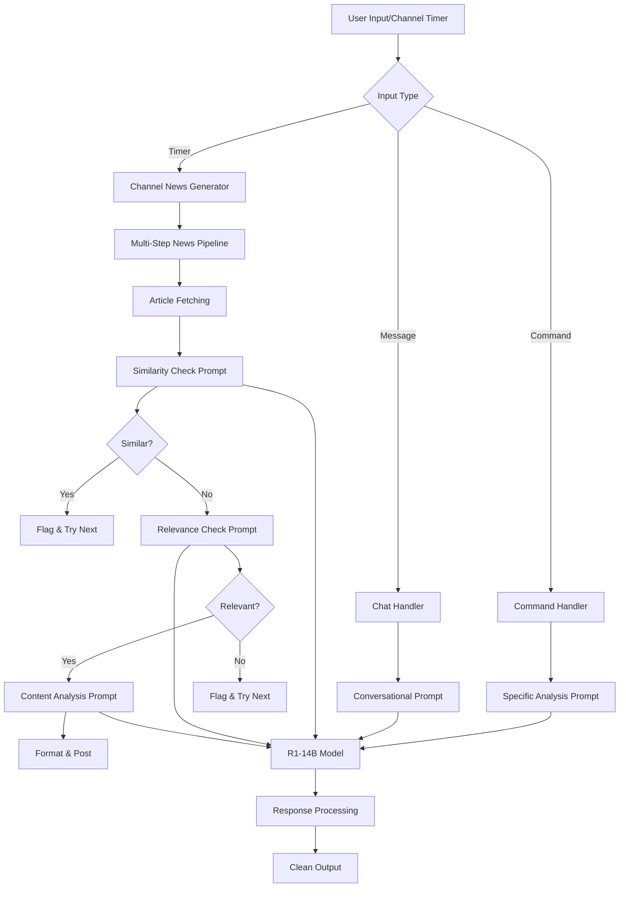
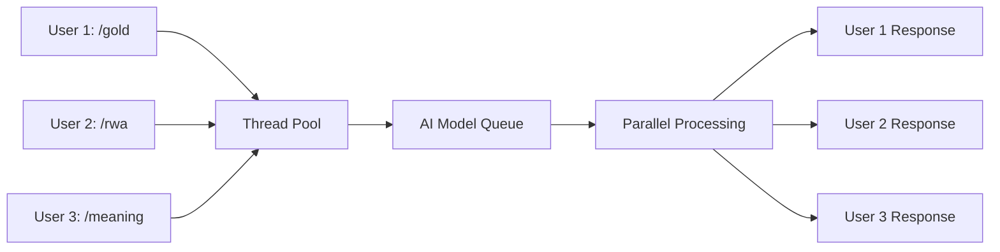

# AI Prompt Framework & Documentation

## 🏗️ System Architecture Overview



## 🔄 Processing Flow

### 1. **Input Classification**
- Commands (`/gold`, `/rwa`, `/meaning`, etc.)
- Free-form chat messages
- Automated channel news generation

### 2. **AI Model Integration**
- **Model**: DeepSeek R1-14B via Ollama
- **Processing**: Async execution to prevent blocking
- **Response Cleaning**: Removes `<think>` tags and extracts final output
- **Fallback**: Curated content if AI unavailable

### 3. **Multi-Step Verification Pipeline**
- **Step 1**: Similarity checking against recent articles
- **Step 2**: Relevance verification using structured checklist
- **Step 3**: Content analysis and formatting
- **Step 4**: EST timezone conversion and posting

---

## 📝 AI Prompts Catalog

### **1. MARKET ANALYSIS COMMANDS**

#### Gold Market Analysis (`/gold`)
```
Provide a concise gold market analysis with 3-4 key points about current trends, institutional activity, and what investors should watch. Format with bullet points.
```

**Purpose**: Generate focused gold market insights  
**Output**: 3-4 bullet points on gold trends  
**Fallback**: Predefined gold market analysis  

#### RWA Market Analysis (`/rwa`)
```
Provide a concise RWA (Real World Assets) tokenization market analysis with 3-4 key points about current trends, institutional adoption, and what investors should watch. Format with bullet points.
```

**Purpose**: Analyze RWA tokenization landscape  
**Output**: 3-4 bullet points on RWA trends  
**Fallback**: Predefined RWA market analysis  

#### Partnership Analysis (`/bd`)
```
Provide a concise analysis of current partnership trends in crypto/RWA/fintech space with 3-4 key points about strategic impact and what investors should watch. Format with bullet points.
```

**Purpose**: Examine strategic partnerships and business development  
**Output**: 3-4 bullet points on partnership trends  
**Fallback**: Predefined partnership analysis  

#### Comprehensive Summary (`/summary`)
```
Provide a comprehensive market summary covering gold, RWA tokenization, and strategic partnerships. Include 4-5 key points about overall market impact and what investors should watch. Format with bullet points.
```

**Purpose**: Generate holistic market overview  
**Output**: 4-5 bullet points covering all major areas  
**Fallback**: Predefined comprehensive summary  

---

### **2. NEWS ANALYSIS SYSTEM**

#### News Significance Analysis (`/meaning`)

**For Text Input:**
```
Analyze this news and provide exactly 3-4 bullet points explaining why it matters. Each bullet should be 1 short sentence (8-12 words). Focus on: market impact, investor implications, broader significance. Format with • symbol.

News: {news_text}
```

**For URL Input (with content extraction):**
```
Analyze this news article and provide exactly 3-4 bullet points explaining why it matters. Each bullet should be 1 short sentence (8-12 words). Focus on: market impact, investor implications, broader significance. Format with • symbol.

URL: {news_url}

Article Content: {extracted_content}
```

**For URL Input (extraction failed):**
```
Analyze this news URL and provide exactly 3-4 bullet points explaining why it might matter. Each bullet should be 1 short sentence (8-12 words). Focus on: market impact, investor implications, broader significance. Format with • symbol.

URL: {news_url}

Note: Could not extract article content, analyze based on URL and general context.
```

**Purpose**: Explain market significance of news  
**Output**: 3-4 concise bullet points on impact  
**Fallback**: Generic impact analysis  

---

### **3. CHANNEL NEWS PIPELINE**

#### Similarity Detection Prompt
```
Analyze if this news article is highly similar to any recent articles:

NEW ARTICLE: "{article_title}"

RECENT UNIQUE ARTICLES:
{list_of_recent_titles_with_dates}

Return "SIMILAR: [reason]" if the new article covers essentially the same event/story as any recent article (same companies, same announcement, same development).
Return "UNIQUE: [reason]" if it's genuinely different news, even if related to similar topics.

Consider: Different sources reporting the same announcement = SIMILAR. Related but different developments = UNIQUE.
```

**Purpose**: Prevent duplicate content posting  
**Logic**: Compares against last 15 unique articles (excludes flagged duplicates)  
**Output**: SIMILAR/UNIQUE with reasoning  
**Action**: If SIMILAR → flag article and try next  

#### Relevance Verification Prompt
```
Using this relevance checklist, evaluate this news article:

EVALUATION CRITERIA: Rate this article's relevance (0-10) based on: 1) Does it involve institutional adoption of RWA/crypto/gold? 2) Are there specific partnerships, deals, or regulatory developments? 3) Will this impact traditional finance or institutional investors? 4) Is this breaking news with market implications? 5) Does it advance the tokenization or digitization of real-world assets?

ARTICLE TITLE: {article_title}
ARTICLE CONTENT: {article_content}

SCORING: 0=not relevant, 1-4=low relevance, 5-7=medium relevance, 8-10=high relevance

Respond with: SCORE: [0-10] | REASON: [brief explanation]
```

**Purpose**: Ensure only relevant content is posted  
**Criteria**: Based on `relevance_checklist.json` with institutional focus  
**Threshold**: Score ≥5 required for posting  
**Action**: If score <5 → flag article and try next  

#### Content Analysis Prompt
```
Analyze this news article and provide exactly 3 bullet points about market impact. Each bullet should be 1 concise sentence (10-15 words max). Format as bullet points with • symbol.

Article: {headline}

{article_content}

Focus on: market implications, investor impact, and strategic significance.
```

**Purpose**: Generate market impact analysis for approved articles  
**Output**: Exactly 3 bullet points on market implications  
**Processing**: Removes thinking process, extracts only bullet points  

---

### **4. CONVERSATIONAL AI**

#### General Chat Response
```
Answer this question concisely in 3-5 bullet points: {user_message}
```

**Purpose**: Handle free-form user questions  
**Output**: 3-5 bullet points addressing the query  
**Fallback**: Command menu if AI unavailable  

---

## 🧠 Response Processing System

### **Thinking Process Extraction**
All AI responses go through cleaning to remove reasoning and extract final output:

1. **Remove `<think>` tags**: Strip out model's reasoning process
2. **Extract bullet points**: Focus on actionable insights
3. **Standardize format**: Convert all bullets to `•` symbol
4. **Length control**: Truncate if exceeding Telegram limits
5. **Fallback generation**: Provide curated content if extraction fails

### **Response Structure**
```python
def extract_final_response(response_text):
    # Remove <think>...</think> blocks
    think_pattern = r'<think>.*?</think>'
    cleaned = re.sub(think_pattern, '', response_text, flags=re.DOTALL | re.IGNORECASE)
    
    # Extract bullet points only
    lines = cleaned.split('\n')
    bullet_points = []
    
    for line in lines:
        clean_line = line.strip()
        if clean_line and (clean_line.startswith('•') or clean_line.startswith('-') or clean_line.startswith('*')):
            if not clean_line.startswith('•'):
                clean_line = '•' + clean_line[1:]
            bullet_points.append(clean_line)
    
    return bullet_points
```

---

## 📊 Quality Control Mechanisms

### **Multi-Attempt System**
- **Max Attempts**: 5 articles per news generation cycle
- **Smart Retry**: Each rejection triggers next article fetch
- **Comprehensive Tracking**: All articles flagged to prevent re-scraping

### **Relevance Categories** (from `relevance_checklist.json`)

#### **RWA Tokenization**
- Keywords: tokenization, real world assets, security tokens, asset digitization
- Institutions: BlackRock, Fidelity, JPMorgan, Goldman Sachs
- Indicators: institutional adoption, regulatory approval, platform launches

#### **Gold Markets**
- Keywords: gold, precious metals, central bank gold, gold ETF
- Institutions: Federal Reserve, ECB, central banks, SPDR Gold
- Indicators: central bank purchases, price movements >2%, new products

#### **Partnerships & Deals**
- Keywords: partnership, collaboration, merger, strategic alliance
- Sectors: fintech, blockchain, digital payments, asset management
- Indicators: tech companies entering crypto, bank partnerships

#### **Regulatory Developments**
- Keywords: regulation, SEC, CFTC, MiCA, compliance, legal framework
- Indicators: new frameworks, product approvals, enforcement actions

### **Scoring System**
- **8-10**: High relevance (institutional focus, major developments)
- **5-7**: Medium relevance (posting threshold)
- **1-4**: Low relevance (flagged, not posted)
- **0**: Not relevant (flagged, not posted)

---

## 🎯 Output Examples

### **Gold Analysis Output**
```
📈 Gold Market Analysis

• Central bank purchases supporting price levels above key thresholds
• Safe-haven flows remain active amid global economic uncertainty  
• Institutional demand strengthening with momentum continuing
• Investors should monitor inflation data and Fed policy signals
```

### **Channel News Output**
```
BlackRock Files for Bitcoin ETF with SEC

• Institutional adoption accelerates as major asset managers embrace crypto
• Regulatory approval could unlock significant institutional capital flows  
• Market infrastructure improvements enable larger transaction volumes

Source: Reuters (https://reuters.com/article-url)
Published: January 15, 2025 at 02:30 PM EST
```

### **Similarity Check Output**
```
🧩 Similarity Check: Comparing 'Bitcoin ETF approval pending...' against 12 unique articles
🧩 Similar Found: Article is similar: Same SEC filing reported by different sources
📋 Article 2 is similar to recent news: Same SEC filing reported by different sources
🔄 Trying next article...
```

---

## 🔧 Technical Implementation

### **Async Processing**
- All AI calls use `asyncio.get_event_loop().run_in_executor()`
- Prevents blocking of Telegram bot operations
- Enables concurrent processing of multiple requests

### **Error Handling**
- Graceful fallbacks for AI unavailability
- Comprehensive logging of all processing steps
- Status tracking and performance metrics

### **Performance Optimization**
- Response caching considerations
- Prompt optimization for concise outputs
- Smart retry logic with exponential backoff

---

## ⚡ Parallel Processing Architecture

### **Async Event Loop Integration**
The bot leverages Python's `asyncio` for non-blocking operations, ensuring Telegram interactions remain responsive during AI processing.

```python
# AI calls run in thread pool to avoid blocking
response = await loop.run_in_executor(
    None, 
    lambda: ollama.chat(
        model=MODEL_NAME,
        messages=[{'role': 'user', 'content': full_prompt}]
    )
)
```

### **Concurrent Operations**

#### **1. Multi-User Command Handling**
Multiple users can simultaneously trigger commands without blocking each other:



#### **2. Background Channel News Generation**
Channel news runs independently of user interactions:

```python
async def main_bot():
    # Concurrent tasks
    news_task = asyncio.create_task(news_scheduler())
    console_task = asyncio.create_task(console_monitor())
    
    # Bot handles users while news generates in background
    await application.updater.start_polling()
```

#### **3. Multi-Step Pipeline Parallelization**
Within news generation, some operations can run concurrently:

```python
# Parallel article processing when multiple sources available
async def process_multiple_sources():
    tasks = [
        fetch_from_source(source1),
        fetch_from_source(source2), 
        fetch_from_source(source3)
    ]
    results = await asyncio.gather(*tasks, return_exceptions=True)
```

### **Thread Pool Management**

#### **AI Model Execution**
```python
async def get_ai_response(prompt: str, context: str = "", command: str = "chat"):
    # Run blocking Ollama call in thread pool
    loop = asyncio.get_event_loop()
    
    response = await loop.run_in_executor(
        None,  # Default thread pool
        lambda: ollama.chat(model=MODEL_NAME, messages=[...])
    )
```

**Benefits:**
- **Non-blocking**: Telegram bot remains responsive
- **Concurrent AI calls**: Multiple users served simultaneously  
- **Resource optimization**: Thread pool reuses threads efficiently

#### **URL Content Extraction**
```python
async def extract_url_content(url: str) -> str:
    # Web scraping runs in thread pool
    loop = asyncio.get_event_loop()
    
    content = await loop.run_in_executor(
        None,
        lambda: scraper.extract_article_content(url)
    )
```

### **Parallel Processing Flow Examples**

#### **Scenario 1: Multiple Users + Channel News**
```
Timeline: 0s ──────── 5s ──────── 10s ──────── 15s
User A:    /gold ████████████████ Response
User B:         /rwa ████████████████ Response  
User C:              /meaning ████████████████ Response
Channel:   ████████████████████████████████████ News Generation
Console:   ████████████████████████████████████ Monitor Active
```

#### **Scenario 2: News Pipeline Parallelization**
```
Article 1: Fetch ██ Similar? ██ Relevant? ██ Analyze ██
Article 2:      Fetch ██ Similar? ██ Relevant? ██ Analyze ██
Article 3:           Fetch ██ Similar? ██ Relevant? ██ Analyze ██

Timeline:  0s ── 2s ── 4s ── 6s ── 8s ── 10s ── 12s
```

### **Concurrency Patterns**

#### **1. Fire-and-Forget Background Tasks**
```python
# Channel news scheduling
async def news_scheduler():
    while news_task_running:
        await asyncio.sleep(NEWS_INTERVAL)  # 30 minutes
        if news_task_running:
            await post_to_channel()  # Non-blocking
```

#### **2. Parallel AI Processing**
```python
# Multiple AI calls can run simultaneously
async def parallel_analysis():
    similarity_task = check_similarity_to_recent_news(title, url)
    relevance_task = verify_news_relevance(title, content)
    
    # Both run concurrently
    is_similar, similarity_reason = await similarity_task
    is_relevant, score, reason = await relevance_task
```

#### **3. Resource Pool Management**
```python
# Thread pool automatically manages concurrent AI calls
class BotStatus:
    def __init__(self):
        self.concurrent_ai_calls = 0
        self.max_concurrent_calls = 5
    
    async def throttled_ai_call(self, prompt):
        if self.concurrent_ai_calls >= self.max_concurrent_calls:
            await asyncio.sleep(0.1)  # Brief wait
        
        self.concurrent_ai_calls += 1
        try:
            result = await get_ai_response(prompt)
        finally:
            self.concurrent_ai_calls -= 1
        
        return result
```

### **Performance Benefits**

#### **Response Time Optimization**
- **Single User**: ~2-3 seconds for AI response
- **Multiple Users**: Same ~2-3 seconds each (parallel processing)
- **Channel News**: Runs independently, doesn't affect user response times

#### **Throughput Scaling**
```
Sequential Processing:
User 1: 3s → User 2: 6s → User 3: 9s (Total: 9s for 3 users)

Parallel Processing:  
User 1: 3s ┐
User 2: 3s ├── All complete at 3s
User 3: 3s ┘
```

#### **Resource Utilization**
- **CPU**: Multi-core utilization through thread pools
- **I/O**: Network requests (RSS feeds, web scraping) don't block AI processing
- **Memory**: Efficient async context switching vs thread overhead

### **Error Handling in Parallel Context**

#### **Graceful Degradation**
```python
async def robust_parallel_processing():
    try:
        # Primary AI processing
        result = await get_ai_response(prompt)
    except Exception as ai_error:
        # Fallback doesn't block other operations
        result = get_fallback_content()
        log_error(f"AI unavailable: {ai_error}")
    
    return result
```

#### **Isolation of Failures**
- **User commands**: Individual failures don't affect other users
- **Channel news**: Failures don't impact user command processing
- **Background tasks**: Errors logged but don't crash main bot

### **Monitoring Parallel Operations**

#### **Real-time Status Tracking**
```python
class ParallelMetrics:
    def __init__(self):
        self.active_ai_calls = 0
        self.active_user_sessions = 0
        self.channel_news_status = "idle"
        self.background_tasks = []
    
    def log_concurrent_state(self):
        print(f"🔄 AI Calls: {self.active_ai_calls}")
        print(f"👥 Users: {self.active_user_sessions}")  
        print(f"📰 Channel: {self.channel_news_status}")
```

#### **Performance Logging**
```
🔥 [14:23:15] /gold - @user1 (concurrent: 1)
🔥 [14:23:16] /rwa - @user2 (concurrent: 2)  
📰 [14:23:17] Channel news generation started (background)
🧠 [14:23:18] AI Processing: 2 parallel calls active
✅ [14:23:20] All responses delivered, channel news continuing
```

This parallel processing architecture ensures the bot remains highly responsive and can handle multiple users while continuously generating channel content in the background.

This framework ensures high-quality, relevant, non-duplicate content delivery while maintaining transparency in AI decision-making processes.
